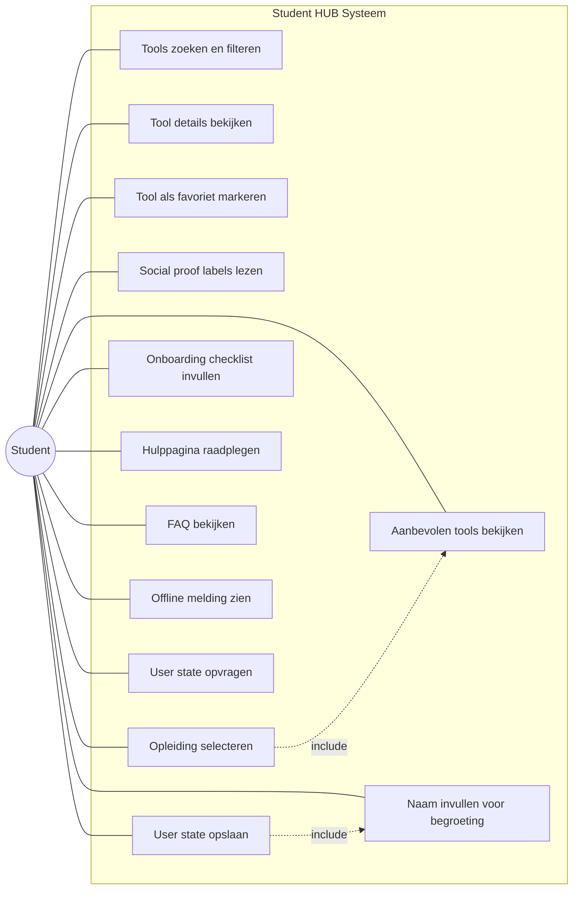
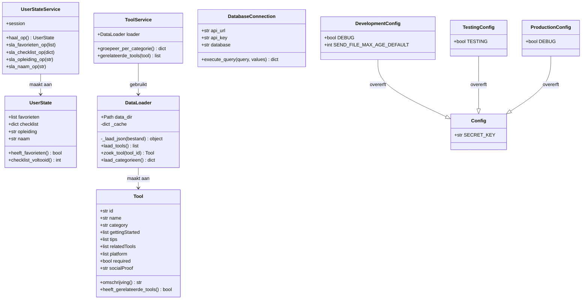
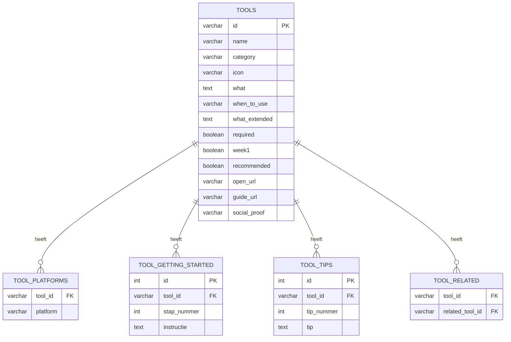

# Code Review Sprint 4 — Student HUB

**Student:** Tije Busker  
**Project:** Student HUB — Flask webapplicatie voor nieuwe HvA-studenten  
**Sprint:** 4  
**Datum:** 20 april 2026  
**Repository:** [gitlab.fdmci.hva.nl — suutuukiiwee41](https://gitlab.fdmci.hva.nl/propedeuse-hbo-ict/onderwijs/student-projecten/2025-2026/out-bim/suutuukiiwee41)

---

## Inhoudsopgave

1. [Applicatie overzicht](#applicatie-overzicht)
2. [Use Case Diagram (UCD)](#use-case-diagram-ucd)
3. [Vijf vertical slices](#vijf-vertical-slices)
4. [OOP — klassen en ontwerp](#oop--klassen-en-ontwerp)
5. [Database — ERD en SQL](#database--erd-en-sql)
6. [Git branching en commits](#git-branching-en-commits)
7. [Bronnen (APA)](#bronnen-apa)

---

## Applicatie overzicht

Student HUB helpt nieuwe HvA-studenten om digitale tools te vinden en hun onboarding te doorlopen. De app is gebouwd met Flask en heeft vijf blueprints:

| Blueprint | URL | Functie |
|-----------|-----|---------|
| `main` | `/` | Homepage met persoonlijke begroeting en aanbevelingen |
| `tools` | `/tools` | Tools overzicht, zoeken, filteren en detailpagina's |
| `journey` | `/journey` | Onboarding checklist met voortgangsbalk |
| `help` | `/help` | Hulppagina met categorieën en FAQ accordion |
| `api` | `/api` | REST API — state, tools, health |

**Wireframes (Figma):** https://www.figma.com/design/zKkFycidI32DkbdQGanh7Q/wireframes

---

## Use Case Diagram (UCD)

Hieronder staat het UCD voor de Student HUB applicatie. De enige actor is de **Student** — er is geen admin of andere rol.

```
┌─────────────────────────────────────────────────────────┐
│                     Student HUB                         │
│                                                         │
│   ○ Tools zoeken en filteren                            │
│   ○ Tool details bekijken                               │
│   ○ Tool als favoriet markeren                          │
│   ○ Social proof labels lezen          ← Sprint 4 (US-47)│
│   ○ Opleiding selecteren                                │
│   ○ Aanbevolen tools bekijken                           │
│   ○ Onboarding checklist invullen                       │
│   ○ Hulppagina raadplegen                               │
│   ○ FAQ bekijken                                        │
│   ○ Naam invullen voor begroeting      ← Sprint 4 (US-50)│
│   ○ Offline melding zien               ← Sprint 4 (US-29)│
│   ○ User state opvragen via API        ← Sprint 4 (US-API)│
│   ○ User state opslaan via API         ← Sprint 4 (US-API)│
│                                                         │
└─────────────────────────────────────────────────────────┘
           |
      [Student]
```



**Toelichting:** Een `<<include>>` relatie betekent dat de ene use case de andere automatisch uitvoert. UC10 (naam invullen) slaat altijd de naam op via UC13 (state opslaan). UC5 (opleiding selecteren) toont altijd UC6 (aanbevelingen).

---

## Vijf vertical slices

Per user story: user story tekst, acceptatiecriteria met checkmarks, branch, code en uitleg.

---

### US-47: Social proof labels op tool-kaarten

**Branch:** `feat/us-47-social-proof` | **Commits:** 2

> Als nieuwe HvA-student wil ik zien hoeveel medestudenten een tool al gebruiken, zodat ik weet welke tools ik prioriteit moet geven.

**Acceptatiecriteria:**
- ✅ Elke tool-kaart kan een social proof label tonen
- ✅ Labels komen uit het `socialProof` veld in de tool data
- ✅ Niet alle tools hoeven een label te hebben (optioneel veld)
- ✅ Styling is subtiel — klein, cursief, lichte kleur
- ✅ Test aanwezig die valideert dat `socialProof` altijd een string is

**Gebaseerd op:** Nudge Theory (Thaler & Sunstein, 2008) — sociale normen beïnvloeden gedrag. Studenten zien wat medestudenten doen en passen hun keuzes aan.

**Model — `app/models/tool.py`:**
```python
@dataclass
class Tool:
    id: str
    name: str
    # ... andere velden ...
    socialProof: str = ""   # optioneel — leeg = geen label
```

**Data — `data/tools.seed.json`:**
```json
{
  "id": "teams",
  "name": "Microsoft Teams",
  "socialProof": "9 op de 10 eerstejaars sturen hun eerste bericht via Teams in week 1"
}
```

**Template — `app/templates/tools/index.html`:**
```html

<span class="tool-card-social-proof">{{ tool.socialProof }}</span>

```

**CSS — `app/static/css/style.css`:**
```css
.tool-card-social-proof {
    display: block;
    font-size: 0.72rem;
    color: var(--hva-tekst-licht);
    margin-top: 4px;
    font-style: italic;
}
```

---

### US-29: Offline foutmelding

**Branch:** `feat/us-29-offline-melding` | **Commits:** 2

> Als nieuwe HvA-student wil ik een duidelijke melding zien wanneer ik geen internetverbinding heb, zodat ik begrijp waarom de app niet werkt en weet wat ik kan doen.

**Acceptatiecriteria:**
- ✅ Gebruiker ziet een rode banner bovenaan de pagina bij geen internet
- ✅ Banner verdwijnt automatisch wanneer verbinding terugkomt
- ✅ Herlaadknop roept `location.reload()` aan
- ✅ Werkt op alle pagina's (via `base.html`)
- ✅ Test aanwezig die controleert dat de banner in de HTML staat

**HTML — `app/templates/base.html`:**
```html
<div id="offline-banner" class="offline-banner" hidden>
  <span>Geen internetverbinding. Controleer je verbinding en probeer het opnieuw.</span>
  <button onclick="location.reload()">Opnieuw proberen</button>
</div>
```

**JavaScript — `app/static/js/offline.js`:**
```javascript
var banner = document.getElementById("offline-banner");

function toonOffline() { banner.hidden = false; }
function verbergOffline() { banner.hidden = true; }

if (!navigator.onLine) { toonOffline(); }

window.addEventListener("offline", toonOffline);
window.addEventListener("online", verbergOffline);
```

**Techniek:** `navigator.onLine` is een browser-eigenschap die `true` of `false` is afhankelijk van de verbindingsstatus. De `offline` en `online` events vuren automatisch bij statuswijziging (MDN, 2024).

---

### US-API-a: UserStateService en GET /api/state

**Branch:** `feat/us-api-a-state-service` | **Commits:** 2 (API-a + API-b samen)

> Als developer wil ik een service en endpoint hebben voor het ophalen van gebruikersstaat, zodat voortgang server-side bewaard kan worden.

**Acceptatiecriteria:**
- ✅ `UserState` dataclass modelleert favorieten, checklist, opleiding en naam
- ✅ `UserStateService` leest de staat uit de Flask sessie
- ✅ `GET /api/state` geeft de huidige staat terug als JSON
- ✅ Lege staat geeft lege lijsten/dicts terug (geen errors)

**Model — `app/models/user_state.py`:**
```python
from dataclasses import dataclass, field

@dataclass
class UserState:
    favorieten: list = field(default_factory=list)
    checklist: dict = field(default_factory=dict)
    opleiding: str = ""
    naam: str = ""

    def heeft_favorieten(self):
        return len(self.favorieten) > 0

    def checklist_voltooid(self):
        if not self.checklist:
            return 0
        aangevinkt = sum(1 for v in self.checklist.values() if v)
        return round(aangevinkt / len(self.checklist) * 100)
```

**Service — `app/api/service.py`:**
```python
class UserStateService:
    def __init__(self, session):
        self.session = session

    def haal_op(self):
        return UserState(
            favorieten=self.session.get("favorieten", []),
            checklist=self.session.get("checklist", {}),
            opleiding=self.session.get("opleiding", ""),
            naam=self.session.get("naam", ""),
        )
```

**Endpoint — `app/api/routes.py`:**
```python
@bp.route("/api/state")
def state_ophalen():
    service = UserStateService(session)
    staat = service.haal_op()
    return jsonify(asdict(staat))
```

---

### US-API-b: PUT endpoints voor gebruikersstaat

**Branch:** `feat/us-api-a-state-service` (2e commit)

> Als developer wil ik PUT endpoints hebben voor het opslaan van gebruikersstaat.

**Acceptatiecriteria:**
- ✅ `PUT /api/state/favorites` slaat favorietenlijst op in sessie
- ✅ `PUT /api/state/checklist` slaat checkliststatus op in sessie
- ✅ `PUT /api/state/opleiding` slaat gekozen opleiding op in sessie
- ✅ `PUT /api/state/naam` slaat naam op in sessie (getrimd)
- ✅ Alle endpoints geven `{"ok": true}` terug bij succes

**Service methoden — `app/api/service.py`:**
```python
def sla_favorieten_op(self, favorieten):
    self.session["favorieten"] = favorieten

def sla_checklist_op(self, checklist):
    self.session["checklist"] = checklist

def sla_opleiding_op(self, opleiding):
    self.session["opleiding"] = opleiding

def sla_naam_op(self, naam):
    self.session["naam"] = naam.strip()
```

**Endpoints — `app/api/routes.py`:**
```python
@bp.route("/api/state/favorites", methods=["PUT"])
def update_favorieten():
    service = UserStateService(session)
    service.sla_favorieten_op(request.json.get("favorieten", []))
    return jsonify({"ok": True})

@bp.route("/api/state/naam", methods=["PUT"])
def update_naam():
    service = UserStateService(session)
    service.sla_naam_op(request.json.get("naam", ""))
    return jsonify({"ok": True})
```

**Flask sessie:** Sessiedata wordt als gesigneerd cookie opgeslagen. Flask gebruikt de `SECRET_KEY` om de handtekening te zetten — zonder die sleutel kan niemand de sessie namaken of aanpassen (Flask docs, 2024).

---

### US-50: Persoonlijke begroeting op de homepage

**Branch:** `feat/us-50-persoonlijke-begroeting` | **Commits:** 1

> Als nieuwe HvA-student wil ik mijn naam kunnen invullen zodat de app mij persoonlijk aanspreekt.

**Acceptatiecriteria:**
- ✅ Student vult naam in via een invoerveld in de hero-sectie
- ✅ App toont "Welkom, [naam]!" als naam bekend is
- ✅ Naam wordt opgeslagen via `PUT /api/state/naam`
- ✅ Naam blijft bewaard na herladen (Flask sessie)
- ✅ Invoerveld is al vooraf ingevuld met bestaande naam

**Route — `app/main/routes.py`:**
```python
from flask import render_template, session

@bp.route("/")
def index():
    return render_template(
        "index.html",
        naam=session.get("naam", ""),
        # ... andere context ...
    )
```

**Template — `app/templates/index.html`:**
```html

<h1>Welkom, {{ naam }}!</h1>

<h1>Welkom bij de HvA</h1>


<div class="hero-naam-form">
  <input type="text" id="naam-input" class="naam-input"
         placeholder="Wat is je naam?" maxlength="50" value="{{ naam }}">
  <button id="naam-opslaan" class="naam-opslaan-knop">Opslaan</button>
</div>
```

**JavaScript — `app/static/js/naam.js`:**
```javascript
var input = document.getElementById("naam-input");
var knop = document.getElementById("naam-opslaan");

if (input && knop) {
    knop.addEventListener("click", function () {
        var naam = input.value.trim();
        fetch("/api/state/naam", {
            method: "PUT",
            headers: { "Content-Type": "application/json" },
            body: JSON.stringify({ naam: naam })
        }).then(function () {
            location.reload();
        });
    });
}
```

---

## OOP — klassen en ontwerp

### Klassen overzicht

| Klasse | Bestand | Verantwoordelijkheid |
|--------|---------|----------------------|
| `Tool` | `app/models/tool.py` | Modelleert een digitale tool met alle attributen |
| `UserState` | `app/models/user_state.py` | Modelleert de gebruikersstaat (nieuw in Sprint 4) |
| `DataLoader` | `app/data.py` | Laadt en cached JSON seed data |
| `UserStateService` | `app/api/service.py` | Leest/schrijft state via Flask sessie (nieuw in Sprint 4) |
| `ToolService` | `app/tools/service.py` | Groepeert tools en zoekt gerelateerde tools op |
| `DatabaseConnection` | `app/db.py` | Verbinding met HBO-ICT cloud database via REST |
| `Config` | `app/config.py` | Basisconfiguratie (superklasse) |
| `DevelopmentConfig` | `app/config.py` | Erft van `Config`, voegt `DEBUG=True` toe |
| `TestingConfig` | `app/config.py` | Erft van `Config`, voegt `TESTING=True` toe |
| `ProductionConfig` | `app/config.py` | Erft van `Config`, zet `DEBUG=False` |

### Klassediagram



### OOP-pijler: Overerving (Inheritance)

In `app/config.py` gebruik ik **overerving** als OOP-pijler. `Config` is de superklasse met gedeelde instellingen. De drie subklassen erven die instellingen en voegen eigen waarden toe:

```python
class Config:
    SECRET_KEY = os.environ.get('SECRET_KEY', 'dev-secret-key')

class DevelopmentConfig(Config):   # erft SECRET_KEY van Config
    DEBUG = True
    SEND_FILE_MAX_AGE_DEFAULT = 0  # CSS/JS niet cachen in dev

class TestingConfig(Config):       # erft SECRET_KEY van Config
    TESTING = True

class ProductionConfig(Config):    # erft SECRET_KEY van Config
    DEBUG = False
```

**Waarom overerving hier zinvol is:** `SECRET_KEY` staat op één plek. Als ik het wil aanpassen, doe ik dat alleen in `Config` en het geldt automatisch voor alle drie omgevingen. Zonder overerving zou ik het drie keer moeten kopiëren — en dan bij elke wijziging drie keer moeten aanpassen.

### Encapsulatie in DataLoader

`DataLoader` heeft een **privé attribuut** `_cache` en een **privé methode** `_laad_json`:

```python
class DataLoader:
    def __init__(self, data_dir):
        self.data_dir = Path(data_dir)
        self._cache = {}           # _ = privé in Python (PEP 8)

    def _laad_json(self, bestand): # privé: alleen intern aanroepen
        if bestand not in self._cache:
            with open(self.data_dir / bestand, encoding="utf-8") as f:
                self._cache[bestand] = json.load(f)
        return self._cache[bestand]

    def laad_tools(self):          # publiek: dit gebruik je van buiten
        if "tools" not in self._cache:
            data = self._laad_json("tools.seed.json")
            self._cache["tools"] = [Tool(**item) for item in data]
        return self._cache["tools"]
```

Externe code roept alleen `laad_tools()` aan. Hoe de caching intern werkt, is verborgen — dat is **encapsulatie**.

---

## Database — ERD en SQL

De app verbindt via `app/db.py` met de HBO-ICT cloud database. De `DatabaseConnection` klasse verstuurt SQL-queries als HTTP POST requests.

### ERD



### SQL schema

```sql
CREATE TABLE tools (
    id            VARCHAR(50)  PRIMARY KEY,
    name          VARCHAR(100) NOT NULL,
    category      VARCHAR(50)  NOT NULL,
    icon          VARCHAR(50),
    what          TEXT,
    when_to_use   VARCHAR(100),
    what_extended TEXT,
    required      BOOLEAN      DEFAULT FALSE,
    week1         BOOLEAN      DEFAULT FALSE,
    recommended   BOOLEAN      DEFAULT FALSE,
    open_url      VARCHAR(255) DEFAULT '#',
    guide_url     VARCHAR(255) DEFAULT '#',
    social_proof  VARCHAR(255) DEFAULT ''
);

CREATE TABLE tool_platforms (
    tool_id  VARCHAR(50) REFERENCES tools(id) ON DELETE CASCADE,
    platform VARCHAR(20) NOT NULL,
    PRIMARY KEY (tool_id, platform)
);

CREATE TABLE tool_getting_started (
    id          SERIAL       PRIMARY KEY,
    tool_id     VARCHAR(50)  REFERENCES tools(id) ON DELETE CASCADE,
    stap_nummer INT          NOT NULL,
    instructie  TEXT         NOT NULL
);

CREATE TABLE tool_tips (
    id          SERIAL       PRIMARY KEY,
    tool_id     VARCHAR(50)  REFERENCES tools(id) ON DELETE CASCADE,
    tip_nummer  INT          NOT NULL,
    tip         TEXT         NOT NULL
);

CREATE TABLE tool_related (
    tool_id         VARCHAR(50) REFERENCES tools(id) ON DELETE CASCADE,
    related_tool_id VARCHAR(50) REFERENCES tools(id) ON DELETE CASCADE,
    PRIMARY KEY (tool_id, related_tool_id)
);
```

### SQL voorbeelden — queries op de database

```sql
-- Alle verplichte week-1 tools ophalen
SELECT id, name, category, social_proof
FROM tools
WHERE required = TRUE AND week1 = TRUE
ORDER BY name;

-- Alle platforms van Microsoft Teams ophalen
SELECT platform
FROM tool_platforms
WHERE tool_id = 'teams';

-- Gerelateerde tools van OneDrive ophalen (via JOIN)
SELECT t.id, t.name, t.category
FROM tools t
JOIN tool_related r ON t.id = r.related_tool_id
WHERE r.tool_id = 'onedrive';

-- Tools per categorie tellen
SELECT category, COUNT(*) AS aantal
FROM tools
GROUP BY category
ORDER BY aantal DESC;

-- Tool toevoegen (INSERT)
INSERT INTO tools (id, name, category, what, required, week1)
VALUES ('new-tool', 'Nieuwe Tool', 'overig', 'Beschrijving hier', FALSE, FALSE);

-- Social proof bijwerken (UPDATE)
UPDATE tools
SET social_proof = 'Meer dan 80% van de eerstejaars gebruikt dit'
WHERE id = 'brightspace';
```

### DatabaseConnection klasse en relatie met tabellen

```python
class DatabaseConnection:
    def __init__(self, api_url, api_key, database):
        self.api_url = api_url
        self.api_key = api_key
        self.database = database

    def execute_query(self, query, values=None):
        x = requests.post(
            url=self.api_url + "/db",
            json={"query": query, "values": values, "database": self.database},
            headers={"Authorization": f"Bearer {self.api_key}"},
            timeout=10,
        )
        return x.json()
```

**Relatie klasse ↔ tabel:**

| `Tool` attribuut | SQL kolom | Type |
|------------------|-----------|------|
| `id` | `tools.id` | `VARCHAR(50) PK` |
| `name` | `tools.name` | `VARCHAR(100)` |
| `gettingStarted` (lijst) | `tool_getting_started` | aparte tabel met FK |
| `tips` (lijst) | `tool_tips` | aparte tabel met FK |
| `relatedTools` (lijst) | `tool_related` | koppeltabel |
| `platform` (lijst) | `tool_platforms` | koppeltabel |

De Python `list` velden bestaan niet als losse kolom in de database — ze worden genormaliseerd naar aparte tabellen met een foreign key naar `tools.id`. Wanneer de app data ophaalt, worden die tabellen gejoind en samengevoegd tot één `Tool` object.

---

## Git branching en commits

Elk user story heeft een eigen branch. Commits tonen de voortgang stap-voor-stap:

```
main
├── feat/us-47-social-proof
│   ├── "US-47: Social proof labels toevoegen aan tool-kaarten"
│   └── "Test toegevoegd voor socialProof veld in tool data"
│
├── feat/us-29-offline-melding
│   ├── "US-29: Offline foutmelding toevoegen"
│   └── "Test toegevoegd om offline banner te controleren in de HTML"
│
├── feat/us-api-a-state-service
│   ├── "US-API-a: UserStateService en GET /api/state endpoint"
│   └── "US-API-b: PUT endpoints voor favorieten, checklist en opleiding"
│
└── feat/us-50-persoonlijke-begroeting
    └── "US-50: Persoonlijke begroeting toevoegen aan homepage"
```

Elke branch wordt via een merge request naar `main` gemerged. Zo is terug te zien wie wat heeft bijgedragen en wanneer.

---

## Bronnen (APA)

Flask. (2024). *Application factories*. Pallets Projects. https://flask.palletsprojects.com/en/stable/patterns/appfactories/

Flask. (2024). *Sessions*. Pallets Projects. https://flask.palletsprojects.com/en/stable/quickstart/#sessions

Flask. (2024). *Blueprints and views*. Pallets Projects. https://flask.palletsprojects.com/en/stable/blueprints/

Jinja2. (2024). *Template inheritance*. Pallets Projects. https://jinja.palletsprojects.com/en/stable/templates/#template-inheritance

Fowler, M. (2002). *Service layer*. martinfowler.com. https://martinfowler.com/eaaCatalog/serviceLayer.html

MDN Web Docs. (2024). *Navigator: onLine property*. Mozilla. https://developer.mozilla.org/en-US/docs/Web/API/Navigator/onLine

MDN Web Docs. (2024). *Window: offline event*. Mozilla. https://developer.mozilla.org/en-US/docs/Web/API/Window/offline_event

MDN Web Docs. (2024). *Fetch API*. Mozilla. https://developer.mozilla.org/en-US/docs/Web/API/Fetch_API

Python Software Foundation. (2024). *dataclasses — Data classes*. https://docs.python.org/3/library/dataclasses.html

Python Software Foundation. (2024). *Classes — inheritance*. https://docs.python.org/3/tutorial/classes.html#inheritance

Thaler, R. H., & Sunstein, C. R. (2008). *Nudge: Improving decisions about health, wealth, and happiness*. Yale University Press.

Van Rossum, G., Warsaw, B., & Coghlan, A. (2001). *PEP 8 — Style guide for Python code*. Python Software Foundation. https://peps.python.org/pep-0008/

W3Schools. (2024). *SQL tutorial*. https://www.w3schools.com/sql/

PostgreSQL Global Development Group. (2024). *PostgreSQL documentation*. https://www.postgresql.org/docs/
